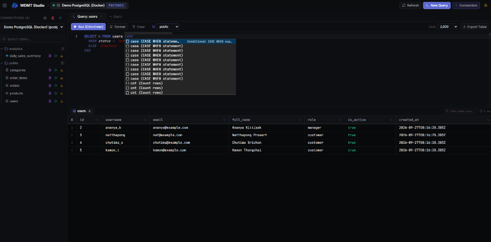
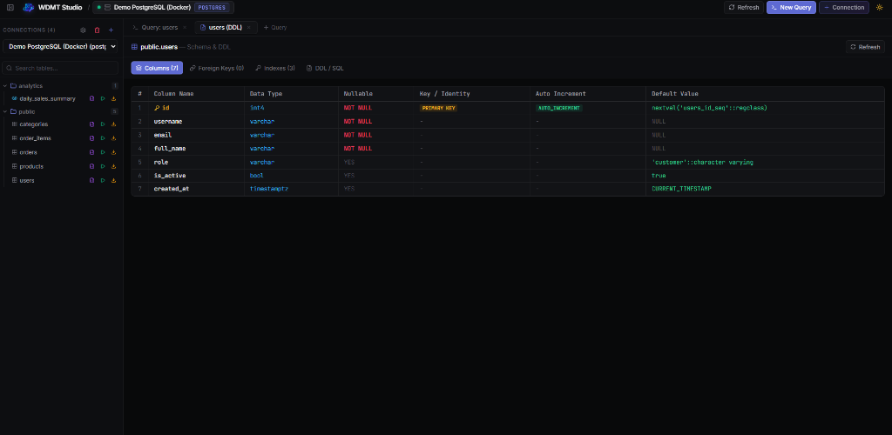
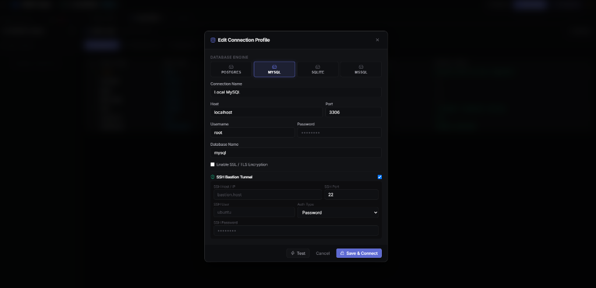

<div align="center">

  

  # ⚡ WDMT — Web-based Database Management Tool
  
  **Modern, High-Performance, Self-Hosted Multi-Database Studio**  
  *Fast, secure, and intuitive database management in your browser.*

  <br />

  [](https://www.typescriptlang.org/)
  [](https://nodejs.org/)
  [](https://react.dev/)
  [](https://www.docker.com/)
  [](LICENSE)

</div>

---

## 🌟 Overview

**WDMT Studio** is a next-generation web-based database client crafted for developers, DBAs, and engineering teams. Engineered with **React 19**, **TypeScript**, and **Node.js 24**, it delivers the desktop-grade snappiness and rich functionality of native tools while remaining 100% self-hosted, lightweight, and containerized.

Whether managing local databases, enterprise SQL Server clusters, or cloud-hosted PostgreSQL/MySQL instances behind SSH Bastion jump hosts, WDMT provides a unified, responsive interface without external third-party dependencies.

---

## 📸 Screenshots

### 1. Monaco SQL Editor & Live Autocomplete
> Write queries with ease using Monaco-powered IntelliSense autocomplete for keywords, tables, columns, and templates, accompanied by virtualized high-speed results rendering.

<div align="center">
  
</div>

<br />

### 2. Table Structure, Schema & DDL Explorer
> Inspect column definitions, data types, nullability, primary keys, auto-increment / serial identities, foreign keys, and indexes with generated `CREATE TABLE` DDL.

<div align="center">
  
</div>

<br />

### 3. Connection Profiles & SSH Bastion Host Tunneling
> Connect securely to any database engine with built-in in-memory SSH port forwarding for VPC / private subnet access.

<div align="center">
  
</div>

---

## ✨ Key Features

- 🗄️ **Multi-Engine SQL Support**:
  - 🐘 **PostgreSQL** (12 – 17+)
  - 🐬 **MySQL / MariaDB** (5.7, 8.0, 10.x)
  - 🪶 **SQLite** (Powered by Node.js 24 Native Engine `node:sqlite`)
  - 🏢 **Microsoft SQL Server (MSSQL)** (2017, 2019, 2022)
- ⚡ **High-Performance Virtualized DataGrid**:
  - Smooth 60fps rendering for tens of thousands of rows using virtualized viewport scrolling.
  - **Inline Cell Editing**: Double-click any cell to edit and auto-commit back to the database.
  - **Insert Row Modal**: Context-aware row creation with auto-increment detection across all engines.
- 💻 **Monaco SQL Editor (VS Code Powered)**:
  - Syntax highlighting, SQL formatting, multi-statement execution, and query limit toggling.
  - **Live IntelliSense Autocomplete**: Context-sensitive suggestions for SQL keywords, active tables, schemas, and columns.
  - Quick execution shortcut: <kbd>Ctrl</kbd> + <kbd>Enter</kbd> (or <kbd>Cmd</kbd> + <kbd>Enter</kbd>).
  - Multi-tab workspace with isolated query contexts.
- 🧱 **Schema & DDL Inspector**:
  - Deep inspection of tables, views, columns, types, foreign key relations, and indexes.
  - Auto-generated DDL definitions for reproducible table creation.
- 🔒 **SSH Bastion Host Tunneling**:
  - Route traffic to private databases via SSH jump hosts using password or private key authentication.
  - Memory-only tunneling streams without opening insecure local host ports.
- 🔐 **AES-256-GCM Encrypted Vault**:
  - All stored credentials, passwords, and private keys are encrypted on-disk using authenticated AES-256-GCM.
- 🌓 **Dual Theme Engine**:
  - Comes with clean **Light Mode** as default and high-contrast **Dark Mode** (Linear Obsidian) with persistent user preference.
- 📦 **Data Export & Dumps**:
  - 1-click export of queries and tables into **CSV**, **JSON**, or raw **SQL INSERT** dumps.
- 🪄 **1-Click Sample Database**:
  - Instant SQLite E-Commerce sandbox with preloaded tables and relational data for immediate testing.

---

## 🛠️ Architecture & Tech Stack

| Component | Technology | Description |
| :--- | :--- | :--- |
| **Backend** | Node.js 24 LTS, Express, TypeScript | High-throughput asynchronous API backend |
| **Frontend** | React 19, TypeScript, Vite | Modern, responsive SPA architecture |
| **Code Editor** | Monaco Editor (`@monaco-editor/react`) | Full VS Code editor core with custom IntelliSense |
| **Database Drivers** | `pg`, `mysql2`, `tedious`, `node:sqlite` | Official, high-reliability engine drivers |
| **Security** | `ssh2`, `node:crypto` (AES-256-GCM) | Encrypted storage vault & in-memory SSH tunneling |
| **Container** | Docker & Docker Compose | Multi-stage Alpine build under 250MB |

---

## 🚀 Quick Start

### Method 1: Docker Compose (Recommended ⭐)

1. Clone the repository:
   ```bash
   git clone https://github.com/FoamNR/wdmt-database-studio.git
   cd wdmt-database-studio
   ```

2. Launch the container:
   ```bash
   docker compose up -d --build
   ```

3. Open your browser:
   - Navigate to: **`http://localhost:5555`**
   - *(All connections and SQLite databases are safely persisted in `./data`)*

---

### Method 2: Local Node.js

**Prerequisites:**
- Node.js 22+ (Node.js 24 recommended)
- npm 10+

1. Install root and client dependencies:
   ```bash
   npm install
   npm --prefix client install
   ```

2. Build the application:
   ```bash
   npm run build
   ```

3. Start the server:
   ```bash
   npm start
   ```
   Open **`http://localhost:3000`** in your browser.

---

### Method 3: Development Mode

```bash
# Starts both the backend API and Vite dev server with Hot Module Replacement (HMR)
npm run dev
```

- **Backend API**: `http://localhost:3000`
- **Frontend Vite Client**: `http://localhost:5173`

---

## ⚙️ Configuration

Customize runtime settings via environment variables or a `.env` file in the root directory:

```ini
# Application port (Default: 5555 in Docker, 3000 in standalone Node)
WDMT_PORT=5555

# Master Encryption Key (Optional: will auto-generate in data/.vault_key if omitted)
# VAULT_MASTER_KEY=your-32-byte-hex-key
```

---

## ⌨️ Keyboard Shortcuts

| Shortcut | Action |
| :--- | :--- |
| <kbd>Ctrl</kbd> + <kbd>Enter</kbd> / <kbd>Cmd</kbd> + <kbd>Enter</kbd> | Execute SQL query in active editor tab |
| <kbd>Ctrl</kbd> + <kbd>B</kbd> / <kbd>Cmd</kbd> + <kbd>B</kbd> | Toggle sidebar open / collapse |
| <kbd>Ctrl</kbd> + <kbd>Space</kbd> | Trigger Monaco SQL IntelliSense suggestions |

---

## 🛡️ Security & Privacy

1. **Zero Cleartext Credentials**: All database passwords and SSH keys are encrypted with **AES-256-GCM** before writing to disk.
2. **Sanitized Output**: Sensitive credential values are automatically stripped before transmitting connection configurations to the client.
3. **In-Memory SSH Forwarding**: SSH tunnels are established entirely within Node.js duplex streams and terminated upon driver disposal.
4. **100% Self-Hosted**: No telemetry, no external trackers, and no remote dependencies.

---

## 📄 License

This project is licensed under the [MIT License](LICENSE) — feel free to use, modify, and distribute it for personal or commercial projects.
